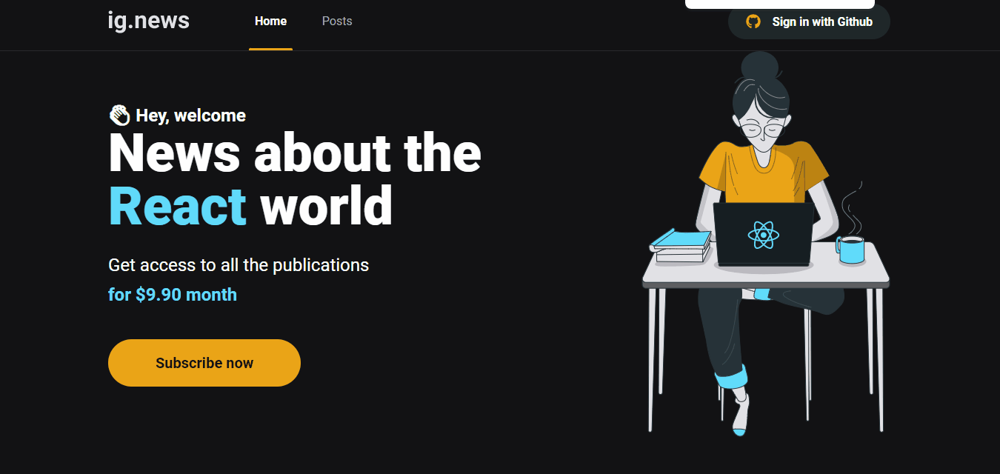

<div align="center">
	<h1>ignews</h1>
</div>

## :camera: Demonstração

<p align="center">
	
</p> -->

## :dart: Objetivo

Essa é uma aplicação parecida com um blog, feita com o [React](https://pt-br.reactjs.org/) e [NextJS](https://nextjs.org/). Para acessar os artigos é necessários fazer o cadastro e pagar a assinatura mensal. O usuário é salvo no [MongoDB](https://www.mongodb.com/) depois do cadastro e a parte de pagamento foi feita com a API do [Stripe](https://stripe.com/en-mx).
Em construção.

## :hammer_and_wrench: Ferramentas

- [React](https://pt-br.reactjs.org/)
- [NextJS](https://nextjs.org/)
- [MongoDB](https://www.mongodb.com/)
- [Stripe](https://stripe.com/en-mx)
- [TypeScript](https://www.typescriptlang.org/)
- [SASS](https://sass-lang.com/)
- [Node](https://nodejs.org/)
- [Yarn](https://yarnpkg.com/)

## :rocket: Executando o projeto

1.Clonando o repositório

```bash
git clone https://github.com/Felipefmv/dashgo
```

2.Para instalar rode

```
yarn
```

3.Rode

```
yarn start
```

4.Acesse http://localhost:3000/
